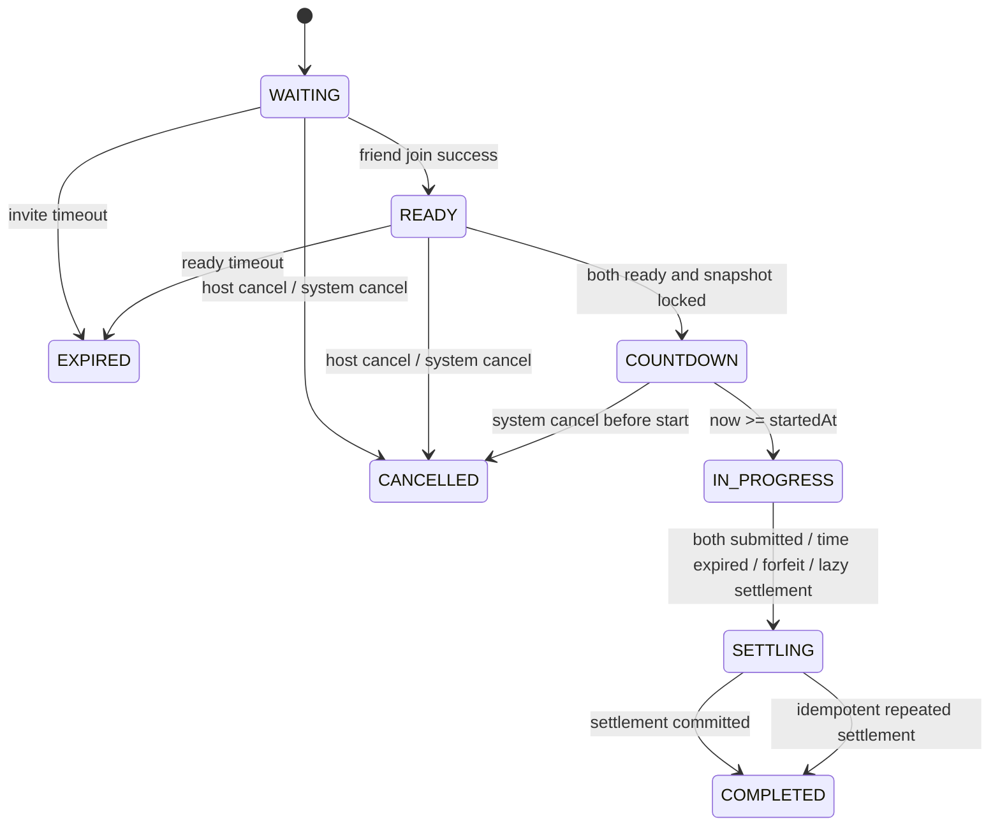

# Battle V1 架构设计冻结

更新日期：2026-07-26
适用阶段：CP-011A / CP-011B / CP-011C / CP-011D / CP-011E
状态：设计冻结，且已完成 CP-011B 数据基础、CP-011C 匹配/好友邀请、CP-011D ready、题目快照、题目下发与单题提交、CP-011E 主动交卷/认输/惰性超时结算/最终胜负判定/rating-profile-rating log 落地，以及 CP-011F 排行榜、战绩与统一错题中心 BATTLE 联动，等待 CP-011G Battle 小程序页面实现

## 1. 文档定位

本文档是 Battle V1 的正式设计基线，用于冻结以下内容：

1. 产品规则与胜负规则
2. 房间状态机
3. 随机匹配与好友邀请流程
4. 统一计时、答题提交、自动交卷与结算规则
5. 对战题库复用策略与题目快照方案
6. 错题中心联动边界
7. Prisma 模型草案
8. REST API 契约草案
9. 小程序页面流转
10. 后续工单拆分

说明：

1. 本文档仍是 Battle V1 的正式契约基线；其主体内容描述的是 Battle V1 的冻结设计，而不是单一工单的即时实现范围。
2. 历史文档中“人机对战”“BattleRecord/BattleQuestion/BattleAnswer”旧草案仅作为历史参考，不再视为当前 V1 正式实现方案。
3. Battle V1 以 1v1 真人知识对战为唯一正式目标，支持随机匹配和好友邀请两种模式。

## 2. 产品定位

Battle 是“码站先锋”的核心产品亮点，用 1v1 限时编程知识对战提升学习兴趣、活跃度和复习频率。

Battle V1 的产品目标：

1. 用户可以发起随机匹配，与另一位在线用户进行一局正式排位对战。
2. 用户可以创建好友房间并通过微信分享邀请好友进入同一对局。
3. 双方在同一时间窗口内回答完全相同的一组题目。
4. 服务端负责计时、判分、胜负结算和排位积分变更。
5. 已提交且被判错的题目，后续可接入统一错题中心。

Battle V1 不包含：

1. 人机对战
2. 实时 WebSocket 推题
3. 语音或文字聊天
4. 道具系统
5. 观战系统
6. 房主自定义题量或时长
7. 对战中即时显示正确答案或解析
8. 对战独立错题本

## 3. 已冻结的核心规则

以下规则已经冻结，不得在实现阶段擅自更改：

1. 对战形式固定为 1v1。
2. 支持随机匹配和好友邀请。
3. 每局题量允许配置为 15 到 20，默认 20。
4. 每局总共享计时固定 180 秒。
5. 双方共用同一计时窗口，不是逐题独立计时。
6. 双方使用完全相同的题目、题目顺序和选项顺序。
7. 答对一题加 2 分。
8. 答错一题扣 1 分。
9. 未作答得 0 分。
10. 总分允许为负数，不做最低 0 分限制。
11. 胜负只由最终 battleScore 决定。
12. 分数相同即平局。
13. 不使用答题耗时打破平局。
14. 未提交的题目不进入错题中心。
15. 只有“成功提交且被服务端判错”的题目进入错题中心。
16. 对局过程中不即时揭示题目正误。
17. 已提交答案不可修改。
18. 正确答案和解析不得在结算前返回给客户端。
19. 计时、判分、结算、积分变化必须由服务端完成。
20. battleScore 与长期 rating 是两个不同概念。
21. 随机匹配影响 rating。
22. 好友邀请记录战绩和胜率，但 ratingDelta 固定为 0。
23. 双方都提前交卷时，可以立即结算。
24. 一方提前交卷后，另一方仍可继续答题直到主动交卷或超时。

## 4. 核心业务流

### 4.1 随机匹配

1. 用户进入对战大厅。
2. 用户点击“开始匹配”。
3. 服务端校验用户没有活跃队列记录，也没有活跃房间。
4. 服务端为用户创建或复用一条 `SEARCHING` 队列记录。
5. 服务端在事务内查找可匹配对手。
6. 若找到对手，则原子创建 `RANKED` 房间与双方参与记录。
7. 双方通过轮询匹配状态获得 `battleId`。
8. 双方进入房间并分别点击“准备”。
9. 双方都准备后，服务端抽题、写入快照、设置统一 `startedAt`。
10. 房间进入 `COUNTDOWN`，倒计时 3 秒。
11. 到达 `startedAt` 后，房间进入 `IN_PROGRESS`。
12. 用户答题、提交、主动交卷或等待超时。
13. 服务端触发幂等结算。
14. 双方进入结算页并可查看历史记录。

### 4.2 好友邀请

1. 用户进入对战大厅。
2. 用户点击“邀请好友”。
3. 服务端创建 `FRIEND` 房间、房主参与记录和邀请令牌。
4. 小程序生成分享路径，路径只携带邀请令牌，不携带 token。
5. 被邀请用户打开分享页，服务端校验邀请有效性。
6. 校验通过后，被邀请用户加入房间。
7. 房间进入 `READY`。
8. 双方分别点击“准备”。
9. 双方都准备后，流程与随机匹配一致。

## 5. 房间模式与状态机

### 5.1 房间模式

```text
RANKED  排位随机匹配
FRIEND  好友邀请房
```

### 5.2 房间状态

```text
WAITING
READY
COUNTDOWN
IN_PROGRESS
SETTLING
COMPLETED
CANCELLED
EXPIRED
```

### 5.3 状态定义

| 状态 | 含义 | 是否终态 |
| --- | --- | --- |
| `WAITING` | 房间已创建，但尚未满足开局前置条件。主要用于好友房等待第二位玩家加入。 | 否 |
| `READY` | 房间已有两位参与者，等待双方分别点击准备。 | 否 |
| `COUNTDOWN` | 双方已准备，题目和正确答案快照已锁定，统一开局倒计时中。 | 否 |
| `IN_PROGRESS` | 对局正式开始，服务端接受答题提交和主动交卷。 | 否 |
| `SETTLING` | 至少触发一次结算流程，系统正在事务内计算结果与积分。 | 否 |
| `COMPLETED` | 对局结果已落库，结果不可再变。 | 是 |
| `CANCELLED` | 开局前被取消或系统异常取消，不计有效战绩。 | 是 |
| `EXPIRED` | 邀请或房间在未开始前超时失效。 | 是 |

### 5.4 状态迁移



### 5.5 非法状态迁移处理

1. `COMPLETED`、`CANCELLED`、`EXPIRED` 为终态，任何会改变业务结果的写操作都返回 `409 BATTLE_INVALID_STATUS`。
2. `WAITING` 状态下不允许 `ready`、不允许获取题目、也不允许提交答案。
3. `READY` 和 `COUNTDOWN` 状态下不允许提交答案。
4. `SETTLING` 状态下不允许继续提交答案或二次交卷。
5. 所有状态迁移必须在事务内完成，并带乐观并发或行级锁。

## 6. 随机匹配方案

### 6.1 V1 最小可行方案

V1 采用“数据库队列 + REST 轮询”方案，不引入 Redis，不引入 WebSocket。

原因：

1. 当前仓库没有 Battle 基础设施，也没有 Redis 和 WebSocket 现成部署约束。
2. 双人对战房间数量在 V1 初期可控，数据库事务足以支撑最小可行实现。
3. REST 轮询可以复用当前小程序请求封装和认证层。

### 6.2 队列记录约束

队列记录至少包含：

1. `userId`
2. `status`：`SEARCHING` / `MATCHED` / `CANCELLED` / `EXPIRED`
3. `ratingSnapshot`
4. `searchStartedAt`
5. `matchedBattleRoomId`
6. `matchedAt`
7. `cancelledAt`
8. `expiresAt`

约束：

1. 同一用户同一时刻只能有一条活跃 `SEARCHING` 记录。
2. 同一用户同一时刻不能同时处于活跃房间和搜索队列。
3. 匹配成功后必须把双方队列记录标记为 `MATCHED`。

### 6.3 匹配策略

V1 随机匹配策略：

1. 先按 `battleRating` 接近优先。
2. 默认起始匹配窗口为 `±100` rating。
3. 每等待 10 秒可扩展一次窗口，例如扩展 `±50`。
4. 同时考虑进入队列时间，优先匹配等待更久的用户。
5. 不允许匹配到自己。
6. 不允许同时出现在两个房间。

### 6.4 并发保证

匹配成功必须在单个事务中完成：

1. 对当前用户和候选用户的 `SEARCHING` 记录执行条件更新抢占，而不是先查后改。
2. 只有双方 `updateMany ... where status=SEARCHING` 都成功时，才允许继续建房。
3. 在同一事务里再次验证双方没有活跃房间。
4. 创建 `BattleRoom`。
5. 创建两条 `BattleParticipant`。
6. 更新两条队列记录的 `matchedBattleRoomId` 与 `matchedAt`。

如果取消请求与匹配请求并发到达，以事务提交成功的一方为准，另一方返回当前最新状态。

## 7. 好友邀请方案

### 7.1 设计原则

1. 好友房不影响 rating。
2. 好友房仍记录战绩、胜负、胜率与历史。
3. 好友房不允许第三人加入。
4. 分享路径只携带 `invitationToken`，不携带认证信息。

### 7.2 邀请对象模型

好友邀请至少包含：

1. `battleId`
2. `hostUserId`
3. `invitationToken`
4. `status`：`ACTIVE` / `ACCEPTED` / `CANCELLED` / `EXPIRED`
5. `expiresAt`
6. `usedByUserId`
7. `usedAt`

### 7.3 流程规则

1. 创建好友房时，房间状态为 `WAITING`。
2. 被邀请人成功加入后，房间进入 `READY`。
3. 令牌默认一次只允许一位有效受邀者完成加入。
4. 已 `ACCEPTED`、`CANCELLED`、`EXPIRED` 的邀请不可再次加入。
5. 已完成房间不可再次通过旧邀请访问。

### 7.4 边界条件

必须处理：

1. 邀请自己
2. 房间已满
3. 房主已取消
4. 令牌过期
5. 已在其他活跃房间中的用户再次加入
6. 分享链接被多次转发或重复打开

## 8. 准备、开局与统一计时

### 8.1 准备规则

Battle V1 统一采用“双人分别点击准备，双方都准备后自动开始”的规则。

不设置房主单独“开始”按钮，原因：

1. 随机匹配和好友房可以共用同一状态机。
2. 可以减少一层额外同步和权限分支。
3. 更适合 REST 轮询模型。

### 8.2 开局规则

1. 房间进入 `READY` 后，双方都必须调用 `POST /api/v1/battles/:battleId/ready`。
2. 第二位用户准备成功时，服务端在同一事务内：
   1. 抽取题目
   2. 写入题目快照
   3. 锁定正确答案快照与解析快照
   4. 生成统一 `startedAt`
   5. 生成统一 `expiresAt`
   6. 将房间状态改为 `COUNTDOWN`
3. 推荐 `startedAt = now + 3 秒`。
4. `expiresAt = startedAt + 180 秒`。
5. 当服务端时间到达 `startedAt` 时，房间视为 `IN_PROGRESS`。

### 8.3 客户端计时校准

客户端只负责显示倒计时，服务端才是唯一时间权威。

客户端通过以下方式校准：

1. 房间详情和题目接口都返回 `serverTime`。
2. 客户端使用 `expiresAt - serverTime` 计算剩余时间。
3. 客户端切后台再回来时，重新拉取房间详情进行校准。
4. 手机本地时间错误不影响服务端判定。

### 8.4 惰性结算

V1 不强制依赖后台定时任务即可完成最终结算。

当任一请求命中过期的 `IN_PROGRESS` 房间时：

1. 服务端先尝试触发惰性结算。
2. 若结算已完成，则返回结算结果。
3. 若尚未结算成功，则以行锁或状态锁推进一次结算。

后续可再增加定时任务补偿长时间无请求的超时房间。

## 9. 题目体系与题库复用策略

### 9.1 Battle V1 基础题型

```text
SINGLE_CHOICE
CODE_FILL
```

### 9.2 SINGLE_CHOICE 展示形态

Battle V1 的 `SINGLE_CHOICE` 至少支持以下展示变体：

```text
TEXT_CHOICE
CODE_READING
CODE_PURPOSE
OUTPUT_PREDICTION
BUG_FIX
CODE_COMPLETION_CHOICE
CODE_SNIPPET_CHOICE
```

说明：

1. 这些是展示与出题形态，不改变底层“单选题”判分规则。
2. 判题仍以唯一正确选项为准。

### 9.3 CODE_FILL 规则

`CODE_FILL` 为输入式代码填空，Battle V1 只做字符串规范化比对，不执行用户代码。

必须冻结的判题规则：

1. 支持多个等价标准答案。
2. 统一把 `\r\n` 规范化为 `\n`。
3. 统一去除整体首尾空白。
4. 默认保留行内空格语义，不做激进压缩。
5. 是否区分大小写由题目配置决定，默认区分大小写。
6. 服务端只做规范化后的字符串集合匹配。
7. 服务端不得执行用户输入代码。
8. 不提供任意代码运行沙箱。

### 9.4 结构化内容块

Battle V1 不得继续假设题干和解析只有普通字符串。

题干与解析至少支持以下块类型：

```text
TEXT
CODE
IMAGE
```

建议结构：

```json
[
  { "type": "TEXT", "text": "以下代码的输出是什么？" },
  { "type": "CODE", "language": "python", "code": "print(1 + 2)" }
]
```

选项内容也应支持结构化展示，至少允许：

1. 纯文本选项
2. 纯代码选项
3. 文本加代码组合

### 9.5 是否直接复用现有 QuizQuestion

结论：

1. Battle V1 不应新建独立的 `BattleQuestionBank`。
2. Battle V1 应优先复用当前 quiz 题库体系，而不是重新建设一套平行题库。
3. 但当前 `QuizQuestion` / `QuizOption` 结构不能直接满足 Battle V1 全部需求，必须在 CP-011B 做最小兼容扩展。

当前不足：

1. `QuizQuestion.content` 是单字符串，不支持结构化题干块。
2. `QuizQuestion.explanation` 是单字符串，不支持结构化解析块。
3. `QuestionType` 当前只有 `SINGLE_CHOICE` 与 `TRUE_FALSE`，没有 `CODE_FILL`。
4. `QuizOption.content` 是单字符串，不支持代码型选项。
5. 缺少展示变体字段，例如 `OUTPUT_PREDICTION`。
6. 缺少难度、语言、知识点、Battle 可用标记等出题元数据。
7. 缺少 `CODE_FILL` 的标准答案与规范化配置。

### 9.6 推荐的最小兼容方向

在 CP-011B 中，优先采用“扩展现有 quiz 题库，而不是创建 battle 专属题库”的方案：

1. 扩展 `QuestionType` 支持 `CODE_FILL`。
2. 为题目增加结构化 `stemBlocks`。
3. 为题目增加结构化 `explanationBlocks`。
4. 为选项增加结构化 `contentBlocks`。
5. 增加 `presentationType`。
6. 增加 `difficulty`、`language`、`knowledgePoint`、`battleEnabled`。
7. 为 `CODE_FILL` 增加 `acceptedAnswers` 与规范化配置。

这样可以让课程 quiz 和 battle 共享同一来源题库，同时保持 Battle 自身只存快照和作答，不重复造一套题库模型。

## 10. 抽题与题目快照方案

### 10.1 抽题规则

Battle V1 抽题策略：

1. 默认抽取 20 题。
2. 题量可配置在 15 到 20。
3. 抽题来源仅限“已发布且可用于 Battle 的题目”。
4. 同一局不得重复题目。
5. 双方使用同一组题目、同一顺序、同一选项顺序。

### 10.2 推荐的 V1 抽题过滤条件

1. 题目必须属于已发布课程和已发布章节。
2. 题目必须通过完整性校验。
3. `SINGLE_CHOICE` 题必须至少有 2 个选项且恰好 1 个正确选项。
4. `CODE_FILL` 题必须至少有 1 个标准答案。
5. 题目分值必须大于 0。

### 10.3 题目不足处理

题库不足时不允许悄悄创建不完整对局。

服务端应：

1. 拒绝从 `READY` 进入 `COUNTDOWN`。
2. 返回明确错误，例如 `BATTLE_QUESTION_POOL_NOT_ENOUGH`。
3. 房间转为 `CANCELLED`，不计战绩和积分。

### 10.4 快照范围

Battle 一旦开始，必须保存完整快照，至少包括：

1. 题干快照
2. 选项快照
3. 正确答案快照
4. 解析快照
5. 题型与展示形态
6. 来源题目 ID
7. 课程、章节、知识点引用

原因：

1. 后续题库编辑不得影响历史战绩。
2. 结算页和历史复盘必须以当时快照为准。
3. 错题复盘优先关联对局快照，而不是当前最新题库内容。

## 11. 提交、幂等与自动交卷

### 11.1 单题提交

每次提交至少包含：

1. `battleQuestionId`
2. `clientRequestId`
3. `answerPayload`

其中：

1. `SINGLE_CHOICE` 使用 `selectedOptionId`
2. `CODE_FILL` 使用 `code`

### 11.2 服务端必校验项

1. 当前用户是该房间参与者。
2. 房间状态为 `IN_PROGRESS`。
3. 当前时间未超过 `expiresAt`。
4. 题目属于当前房间。
5. 该用户尚未成功提交该题。
6. `clientRequestId` 幂等。
7. 答案格式合法。
8. 服务端可独立完成判题。

### 11.3 幂等规则

1. 同一 `clientRequestId` 重试，返回同一提交结果。
2. 同一用户对同一题只能存在一条有效提交记录。
3. 网络重试不得重复加分或扣分。
4. 客户端“显示已提交”不代表最终有效，必须以服务端响应为准。

### 11.4 跳过规则

Battle V1 中的“跳过”仅是客户端导航行为，不产生服务端提交记录。

因此：

1. 跳过后可稍后再答。
2. 若最终仍未提交，则该题为 `unanswered`。
3. 未提交题目不扣分，也不记入错题中心。

### 11.5 主动交卷

`POST /api/v1/battles/:battleId/submit` 表示当前用户主动结束自己的作答。

规则：

1. 主动交卷后，该用户不能再提交任何答案。
2. 若另一方仍未交卷且未超时，则对局仍保持 `IN_PROGRESS`。
3. 双方都交卷后可立即触发结算。
4. 到达 `expiresAt` 后，未交卷用户自动视为交卷。

### 11.6 主动退出与认输

Battle V1 区分“主动交卷”和“主动认输”：

1. 主动交卷：保留当前已答结果，继续按实际 battleScore 结算。
2. 主动认输：立即结束该用户对局资格，并把该场按失败处理。

建议保留单独接口：

```text
POST /api/v1/battles/:battleId/forfeit
```

认输后：

1. 房间进入 `SETTLING`。
2. 对方按获胜处理。
3. 已提交答案仍保留。
4. 认输不额外生成未提交题目的错题。

## 12. 判分与结算规则

### 12.1 battleScore 公式

```text
battleScore = correctCount * 2 - wrongCount
```

说明：

1. `correctCount`：成功提交且判对的题目数。
2. `wrongCount`：成功提交且判错的题目数。
3. `unansweredCount`：未成功提交的题目数。
4. `unansweredCount` 不参与扣分。

### 12.2 结算触发条件

以下任一条件满足即可进入 `SETTLING`：

1. 双方都主动交卷
2. 到达 `expiresAt`
3. 任一方主动认输
4. 任一请求命中过期房间并触发惰性结算

### 12.3 结算内容

结算至少计算：

1. 双方 `correctCount`
2. 双方 `wrongCount`
3. 双方 `unansweredCount`
4. 双方 `battleScore`
5. `WIN` / `LOSS` / `DRAW`
6. `ratingDelta`
7. 更新后的 rating
8. 是否生成 Battle 错题来源记录

### 12.4 平局规则

Battle V1 平局规则固定为：

1. battleScore 相同即平局。
2. 不使用答题耗时打破平局。
3. 可在结果页展示总耗时，但仅作展示，不影响结果。

### 12.5 幂等结算

结算必须具备幂等性：

1. 只有一个事务可将房间从 `IN_PROGRESS` 或 `SETTLING` 推进到最终完成。
2. 重复触发结算时，只读取已存在结果，不重复改分。
3. `BattleRatingLog` 与房间结算必须在同一事务内落库。

## 13. Rating 与排行榜方案

### 13.1 统计口径

Battle V1 至少持久化以下长期统计：

1. `rating`
2. `totalBattles`
3. `rankedBattles`
4. `friendBattles`
5. `wins`
6. `losses`
7. `draws`
8. `currentWinStreak`
9. `bestWinStreak`
10. `highestRating`

说明：

1. `winRate` 不冗余存储，由查询时计算。
2. `currentRank` 不冗余存储，由排行榜查询时计算。

### 13.2 Rating 方案

V1 推荐使用简化 Elo：

1. 新用户初始 `rating = 1000`
2. 仅 `RANKED` 对局参与 rating 变化
3. `FRIEND` 对局 `ratingDelta = 0`
4. 使用标准 Elo 期望值公式
5. 推荐固定 `K = 32`
6. 平局按 `actualScore = 0.5`
7. rating 不得低于 0

### 13.3 战绩是否计入

| 场景 | 是否计入战绩 | 是否影响 rating |
| --- | --- | --- |
| 随机匹配正常完成 | 是 | 是 |
| 好友房正常完成 | 是 | 否 |
| 进行中主动认输 | 是 | 是，若为 `RANKED` |
| 开局前取消 | 否 | 否 |
| 邀请超时未开局 | 否 | 否 |
| 系统取消 | 否 | 否 |

### 13.4 排行榜排序

Battle 全局排行榜按以下顺序排序：

1. `rating DESC`
2. `rankedBattles DESC`
3. `userId ASC`

排行榜先按用户画像专业（`User.major` 经 `getTrackForMajor()` 映射）投影为一条记录，再排序、计算名次和分页。分数使用该画像专业对应的 `UserBattleTrackRating.rating`；不使用其他专业、最高值、平均值或 `BattleProfile.rating`。专业名称仅作为画像信息展示，不作为排行榜筛选条件。

匹配使用全局池，题目与 Rating 结算仍按每位玩家自己的专业方向执行。

## 14. 战绩与历史复盘

### 14.1 战绩列表最小字段

1. `battleId`
2. `mode`
3. `result`
4. `myScore`
5. `opponentScore`
6. `ratingDelta`
7. `completedAt`
8. `opponent`

### 14.2 战绩详情最小字段

1. 双方基础信息
2. 双方总分
3. 胜负结果
4. rating 变化
5. 每题快照
6. 我的答案
7. 正确答案
8. 是否答对
9. 单题得分变化
10. 解析
11. 关联课程与章节

### 14.3 返回答案的时机

只有在房间 `COMPLETED` 后，战绩详情和结果页才允许返回：

1. 正确答案
2. 解析
3. 单题判定结果

## 15. 统一错题中心联动

### 15.1 总体原则

Battle 不得建设独立错题本。

Battle 错题必须接入现有统一错题中心，并作为未来的 `BATTLE` 来源。

### 15.2 进入错题中心的条件

只有同时满足以下条件的题目才计入 Battle 错题：

1. 当前用户成功提交了答案
2. 服务端判定该题错误

以下情况不进入错题中心：

1. 未作答
2. 跳过但未提交
3. 超时未提交
4. 主动交卷前未提交
5. 请求失败且服务端未保存

### 15.3 与现有 wrong-question 的关系

当前统一错题中心正式实现仍基于运行时聚合；`LEARNING` 来源来自 `QuizAnswer` / `QuizAttempt`，`BATTLE` 来源已在 `CP-011F` 接入 `BattleAnswer` + `BattleQuestionSnapshot` 读模型。

因此 Battle V1 的联动策略是：

1. Battle 在自己的 `BattleAnswer` 中保存被判错的正式作答记录。
2. `CP-011F` 已扩展统一错题中心读模型，按 `source + questionId` 做运行时聚合。
3. 不新增 `WrongQuestion` 持久化模型，也不新增 Battle 专属错题表。
4. 同一用户、同一来源题目多次答错时聚合为一条；`LEARNING` 与 `BATTLE` 当前按来源分开聚合。

## 16. 异常与并发处理规则

### 16.1 断网与切后台

1. 切后台不暂停计时。
2. 重新进入时，客户端根据服务端状态恢复。
3. 临时断网不直接判负。
4. 超时后按服务端已保存的答案结算。

### 16.2 对局取消原因建议

```text
USER_FORFEIT
MATCH_TIMEOUT
SYSTEM_CANCELLED
INVITATION_EXPIRED
READY_TIMEOUT
QUESTION_POOL_NOT_ENOUGH
```

### 16.3 关键并发风险

必须防止：

1. 同一用户重复加入匹配队列
2. 匹配成功和取消同时发生
3. 同一题重复提交
4. 主动交卷与超时自动交卷同时发生
5. 结算被重复触发
6. rating 被重复写入

## 17. 安全与防作弊

Battle V1 至少满足以下安全要求：

1. 正确答案与解析在结算前不返回客户端。
2. 题目得分、最终结果、ratingDelta 不接受客户端上传。
3. 服务端独立判题。
4. 服务端独立计时。
5. 所有答题接口必须鉴权。
6. 必须校验当前用户是否为房间参与者。
7. 必须校验题目归属房间。
8. 必须校验房间状态。
9. 必须保证单题提交幂等。
10. 对 `CODE_FILL` 只做字符串规范化匹配，不执行代码。
11. 匹配、答题和交卷接口都需要基础限流。

## 18. Prisma 模型草案

说明：

1. 以下字段与约束现已作为 Battle V1 正式数据基线，其中 `CP-011B` 已完成 Prisma schema、migration 与 Prisma Client 落地。
2. 当前未实现的是 Battle 小程序页面、运行态联调与体验版产品闭环，不是数据模型本身。

### 18.1 BattleProfile

作用：

1. 维护用户 Battle 长期统计与 rating。
2. 避免把过多对战统计挤进 `User` 主表。

关键字段：

1. `userId`，与 `User` 一对一
2. `rating`
3. `highestRating`
4. `totalBattles`
5. `rankedBattles`
6. `friendBattles`
7. `wins`
8. `losses`
9. `draws`
10. `currentWinStreak`
11. `bestWinStreak`

关键约束：

1. `userId` 唯一
2. `rating >= 0`

实现说明：

1. `CP-011B` 已实际落地 `BattleProfile`。
2. `BattleProfile.rating` 保留为历史兼容统计，不作为全局排行榜权威来源。
3. 排行榜使用 `UserBattleTrackRating` 中与用户画像专业匹配的 track 记录。
4. `User.battleRating` 在 `CP-011B` 暂时保留，仅作为兼容初始化字段。

是否建议在 CP-011B 创建：已在 CP-011B 创建

### 18.2 BattleRoom

作用：

1. 表示一场 1v1 对局。

关键字段：

1. `id`
2. `mode`
3. `status`
4. `questionCount`
5. `durationSeconds`
6. `correctScore`
7. `wrongScore`
8. `unansweredScore`
9. `createdByUserId`
10. `startedAt`
11. `expiresAt`
12. `settledAt`
13. `completedAt`
14. `cancelledAt`
15. `endReason`
16. `winnerUserId`
17. `createdAt`
18. `updatedAt`

关键索引：

1. `status`
2. `mode + status`
3. `createdAt`
3. `expiresAt`

是否建议在 CP-011B 创建：已在 CP-011B 创建

### 18.3 BattleParticipant

作用：

1. 记录房间中的用户与个人状态。

关键字段：

1. `battleRoomId`
2. `userId`
3. `seat`：`1` / `2`
5. `readyAt`
6. `submittedAt`
7. `forfeitedAt`
8. `correctCount`
9. `wrongCount`
10. `unansweredCount`
11. `score`
12. `result`
13. `ratingBefore`
14. `ratingDelta`
15. `ratingAfter`

关键约束：

1. `battleRoomId + userId` 唯一
2. `battleRoomId + seat` 唯一

是否建议在 CP-011B 创建：已在 CP-011B 创建

### 18.4 BattleQuestionSnapshot

作用：

1. 保存对局内题目和答案快照。

关键字段：

1. `battleRoomId`
2. `sourceQuizQuestionId`
3. `courseIdSnapshot`
4. `chapterIdSnapshot`
5. `questionType`
6. `presentation`
7. `orderIndex`
8. `stemSnapshot`
9. `optionsSnapshot`
10. `correctAnswerSnapshot`
11. `explanationSnapshot`
12. `knowledgeTagsSnapshot`
13. `acceptedAnswersSnapshot`
14. `answerNormalizationSnapshot`
15. `programmingLanguage`

关键约束：

1. `battleRoomId + orderIndex` 唯一
2. `battleRoomId + sourceQuestionId` 不要求唯一，但同一局抽题时业务上禁止重复

是否建议在 CP-011B 创建：已在 CP-011B 创建

### 18.5 BattleAnswer

作用：

1. 保存用户对 Battle 题目的正式作答与判题结果。

关键字段：

1. `battleRoomId`
2. `participantId`
3. `battleQuestionSnapshotId`
4. `clientRequestId`
5. `answerPayload`
6. `normalizedAnswer`
7. `isCorrect`
8. `scoreDelta`
9. `submittedAt`

关键约束：

1. `participantId + battleQuestionSnapshotId` 唯一
2. `participantId + clientRequestId` 唯一

是否建议在 CP-011B 创建：已在 CP-011B 创建

### 18.6 BattleInvitation

作用：

1. 保存好友房分享令牌与有效期。

关键字段：

1. `battleRoomId`
2. `inviterUserId`
3. `inviteeUserId`
4. `status`
5. `expiresAt`
6. `token`
7. `acceptedAt`
8. `cancelledAt`

关键约束：

1. `token` 唯一
2. `battleRoomId` 唯一

是否建议在 CP-011B 创建：已在 CP-011B 创建

### 18.7 BattleRatingLog

作用：

1. 审计每次排位积分变化，保证 settlement 可追溯且不可重复结算。

关键字段：

1. `battleRoomId`
2. `participantId`
3. `userId`
4. `reason`
5. `ratingBefore`
6. `ratingDelta`
7. `ratingAfter`
8. `createdAt`

关键约束：

1. `battleRoomId + userId + reason` 唯一

是否建议在 CP-011B 创建：已在 CP-011B 创建

### 18.8 BattleMatchQueue

作用：

1. 支撑 V1 数据库匹配队列。

关键字段：

1. `userId`
2. `status`
3. `ratingSnapshot`
4. `searchStartedAt`
5. `expiresAt`
6. `matchedBattleRoomId`

关键约束：

1. 当前 `CP-011B` 采用 `userId` 全局唯一方案，每个用户复用一条队列记录

是否建议在 CP-011B 创建：已在 CP-011B 创建

## 19. API 契约草案

说明：

1. 当前仅冻结契约，不代表接口已实现。
2. 全部接口都需要 `USER` 鉴权。

### 19.1 对战概览

```text
GET /api/v1/battles/profile
GET /api/v1/battles/leaderboard
```

`GET /api/v1/battles/profile` 返回：

1. `rating`
2. `currentRank`
3. `totalBattles`
4. `rankedBattles`
5. `friendBattles`
6. `wins`
7. `losses`
8. `draws`
9. `winRate`
10. `currentWinStreak`
11. `bestWinStreak`
12. `highestRating`

说明：

1. `GET /api/v1/battles/profile` 与 `GET /api/v1/battles/leaderboard` 已在 `CP-011F` 实现。
2. `/leaderboard` 是单一全局榜；`professionalTrackKey` 仅为旧客户端兼容参数，不参与筛选。
3. 全局榜分数来自用户画像专业对应的 `UserBattleTrackRating`，专业标签来自 `User.major` 映射；`winRate` 与 `rank/currentRank` 按查询时动态计算。

### 19.2 随机匹配

```text
POST /api/v1/battles/matchmaking/join
DELETE /api/v1/battles/matchmaking
GET /api/v1/battles/matchmaking/status
```

`POST /join` 返回：

1. `status`
2. `battleId`
3. `searchStartedAt`
4. `expiresAt`
5. `serverTime`

`GET /status` 返回：

1. `IDLE` / `SEARCHING` / `MATCHED` / `CANCELLED` / `EXPIRED`
2. `battleId`
3. `searchStartedAt`
4. `expiresAt`
5. `serverTime`

### 19.3 好友邀请

```text
POST /api/v1/battles/friend-rooms
GET /api/v1/battles/friend-rooms/:invitationToken
POST /api/v1/battles/friend-rooms/:invitationToken/join
```

### 19.4 房间与题目

```text
GET /api/v1/battles/:battleId
POST /api/v1/battles/:battleId/ready
GET /api/v1/battles/:battleId/questions
```

说明：

1. `GET /api/v1/battles/:battleId` 已在 `CP-011C` 实现。
2. `POST /api/v1/battles/:battleId/ready`、`GET /api/v1/battles/:battleId/questions` 与 `POST /api/v1/battles/:battleId/answers` 已在 `CP-011D` 实现。

`GET /api/v1/battles/:battleId` 至少返回：

1. `battleId`
2. `mode`
3. `status`
4. `serverTime`
5. `startedAt`
6. `expiresAt`
7. `questionCount`
8. 当前用户参与信息
9. 对手基础信息
10. 双方 `ready` / `submitted` 状态
11. 已提交题数

`GET /questions` 在结算前不得返回：

1. `correctAnswerSnapshot`
2. `explanationBlocks`

### 19.5 答题与交卷

```text
POST /api/v1/battles/:battleId/answers
POST /api/v1/battles/:battleId/submit
POST /api/v1/battles/:battleId/forfeit
```

`POST /answers` 请求示例：

```json
{
  "battleQuestionId": "uuid",
  "clientRequestId": "uuid-or-ulid",
  "answer": {
    "type": "SINGLE_CHOICE",
    "selectedOptionId": "uuid"
  }
}
```

`CODE_FILL` 示例：

```json
{
  "battleQuestionId": "uuid",
  "clientRequestId": "uuid-or-ulid",
  "answer": {
    "type": "CODE_FILL",
    "code": "range(1, 6)"
  }
}
```

答题响应只返回：

1. `accepted`
2. `battleQuestionId`
3. `submittedAt`
4. `mySubmittedCount`
5. `totalQuestions`

不返回：

1. 是否正确
2. 正确答案
3. 解析
4. 当前总分

### 19.6 结果与历史

```text
GET /api/v1/battles/:battleId/result
GET /api/v1/battles/history
GET /api/v1/battles/history/:battleId
```

结果页返回：

1. `WIN` / `LOSS` / `DRAW`
2. `myScore`
3. `opponentScore`
4. `myCorrectCount`
5. `myWrongCount`
6. `myUnansweredCount`
7. `opponentCorrectCount`
8. `opponentWrongCount`
9. `opponentUnansweredCount`
10. `ratingBefore`
11. `ratingDelta`
12. `ratingAfter`
13. `completedAt`

说明：

1. `GET /api/v1/battles/:battleId/result` 已在 `CP-011E` 实现。
2. `GET /api/v1/battles/history` 与 `GET /api/v1/battles/history/:battleId` 已在 `CP-011F` 实现。
3. 历史详情只读取 `BattleQuestionSnapshot`、当前用户自己的 `BattleAnswer` 与对手汇总信息，不返回对手逐题答案。

### 19.7 错误码建议补充

```text
BATTLE_ALREADY_IN_QUEUE
BATTLE_ACTIVE_ROOM_EXISTS
BATTLE_NOT_PARTICIPANT
BATTLE_NOT_READY
BATTLE_QUESTION_POOL_NOT_ENOUGH
BATTLE_READY_TIMEOUT
BATTLE_INVITATION_EXPIRED
BATTLE_INVITATION_INVALID
BATTLE_FORFEIT_NOT_ALLOWED
BATTLE_INVALID_LEADERBOARD_QUERY
BATTLE_HISTORY_NOT_FOUND
BATTLE_HISTORY_NOT_COMPLETED
```

## 20. 小程序页面规划

Battle V1 小程序页面规划：

1. `pages/battle/index`
2. `pages/battle/matchmaking`
3. `pages/battle/friend-room`
4. `pages/battle/room`
5. `pages/battle/result`
6. `pages/battle/history`
7. `pages/battle/history-detail`
8. `pages/battle/leaderboard`

### 20.1 pages/battle/index

职责：

1. 展示 Battle 入口
2. 展示个人 Battle 概览
3. 进入随机匹配或好友邀请
4. 进入排行榜和历史

### 20.2 pages/battle/matchmaking

职责：

1. 展示匹配中状态
2. 定时轮询匹配状态
3. 支持取消匹配
4. 成功后跳转房间

### 20.3 pages/battle/friend-room

职责：

1. 展示分享邀请状态
2. 展示房间成员
3. 双方准备
4. 倒计时开局

### 20.4 pages/battle/room

职责：

1. 展示共享倒计时
2. 展示题目和答题导航
3. 提交单题答案
4. 主动交卷或认输
5. 轮询房间状态与对手提交进度

### 20.5 pages/battle/result

职责：

1. 展示胜负和分数
2. 展示 ratingDelta
3. 展示逐题复盘
4. 跳转战绩历史

### 20.6 pages/battle/history

职责：

1. 分页展示战绩列表
2. 按模式查看 `RANKED` / `FRIEND`

### 20.7 pages/battle/history-detail

职责：

1. 展示完整复盘
2. 查看 Battle 来源错题相关题目

### 20.8 pages/battle/leaderboard

职责：

1. 展示排行榜
2. 高亮当前用户名次

## 21. V1 验收场景

至少覆盖：

1. 两名用户随机匹配成功，进入同一 `RANKED` 房间。
2. 两名用户通过好友邀请进入同一 `FRIEND` 房间。
3. 双方准备后统一倒计时并同时开始。
4. 两人看到完全相同的题目和选项顺序。
5. 单题重复提交不会重复计分。
6. 一方提前交卷，另一方仍可继续作答。
7. 双方都提前交卷时立即结算。
8. 到达 `expiresAt` 后未交卷用户自动结算。
9. 平局时不以答题耗时判胜负。
10. 认输只在 `IN_PROGRESS` 允许。
11. 仅已提交且答错题目进入 `BATTLE` 错题来源。
12. 结算前客户端拿不到正确答案和解析。
13. `RANKED` 有 ratingDelta，`FRIEND` 的 ratingDelta 必须为 0。
14. 历史复盘读取题目快照而不是当前题库实时内容。

## 22. 后续工单拆分建议

| 工单 | 目标 | 前置依赖 | 是否修改 schema | 是否需要 migration | 验收重点 |
| --- | --- | --- | --- | --- | --- |
| `CP-011B` | Battle 数据模型、枚举、Prisma migration 与领域对象落地 | 本文档 | 是 | 是 | Battle 相关表结构、唯一约束、索引和基础读写能力落地 |
| `CP-011C` | 随机匹配与好友邀请 | `CP-011B` | 否 | 否 | 队列、邀约、房间创建、并发安全 |
| `CP-011D` | 房间准备、统一计时、题目抽取与下发、单题提交 | `CP-011C` | 可能 | 可能 | COUNTDOWN、IN_PROGRESS、幂等答题、快照 |
| `CP-011E` | 主动交卷、自动结算、认输、rating 计算 | `CP-011D` | 可能 | 可能 | battleScore、平局、Elo、幂等 settlement |
| `CP-011F` | 战绩、排行榜与统一错题中心 BATTLE 联动 | `CP-011E` | 否 | 否 | 已完成；history、leaderboard、wrong-question 聚合扩展已落地 |
| `CP-011G` | Battle 小程序完整页面 | `CP-011F` | 否 | 否 | 大厅、匹配、房间、结果、历史、排行榜 |
| `CP-011H` | 运行态联调、异常恢复、并发回归 | `CP-011G` | 否 | 否 | 切后台、断网、重复请求、超时与回归 |

## 23. 需要 Product Owner / Tech Lead 最终确认的事项

1. 题量默认值是否固定为 20，还是允许按活动配置切换到 15 或 18。
2. 随机匹配首轮 rating 窗口与扩窗节奏是否采用 `±100 / 每10秒+50`。
3. `CODE_FILL` 默认是否大小写敏感。
4. Battle V1 是否要求首版排行榜只展示前 100 名。
5. 好友邀请有效期是否固定 10 分钟。
6. 认输后的展示文案是否区分“主动认输”和“时间结束失败”。
7. 错题中心未来是否需要来源筛选开关默认显示“全部来源”。

## 24. 当前实现状态说明

截至 2026-07-26：

1. `CP-011B` 已完成 Battle Prisma 枚举、核心模型、共享题库扩展与迁移 `20260725021220_add_battle_v1_core_models`。
2. `CP-011B` 已完成 BattleModule、BattleScoreService、BattleRatingService、BattleDomainService 与对应单元测试。
3. `CP-011C` 已完成 `POST /api/v1/battles/matchmaking/join`、`GET /api/v1/battles/matchmaking/status`、`DELETE /api/v1/battles/matchmaking`、`POST /api/v1/battles/friend-rooms`、`GET /api/v1/battles/friend-rooms/:invitationToken`、`POST /api/v1/battles/friend-rooms/:invitationToken/join` 与 `GET /api/v1/battles/:battleId`。
4. `CP-011C` 已实现数据库队列 + REST 轮询的惰性匹配、扩窗匹配算法、事务内原子建房、好友邀请 token、好友房 `seat 2` 并发抢占保护与房间基础查询。
5. `CP-011D` 已完成 `POST /api/v1/battles/:battleId/ready`、`GET /api/v1/battles/:battleId/questions`、`POST /api/v1/battles/:battleId/answers`、BattleQuestionSnapshot 冻结、`startedAt` / `expiresAt` 统一生成、`COUNTDOWN -> IN_PROGRESS` 惰性推进、SINGLE_CHOICE 服务端判分、CODE_FILL 字符串规范化判分以及 `clientRequestId` 幂等。
6. 当前 Battle 已实现主动交卷、认输、惰性超时结算、最终胜负写入、RANKED Elo 与 FRIEND 结算规则、profile、leaderboard、history、history detail 与统一错题中心 BATTLE 联动；但小程序 Battle 页面、运行态联调和产品级闭环仍未完成。
